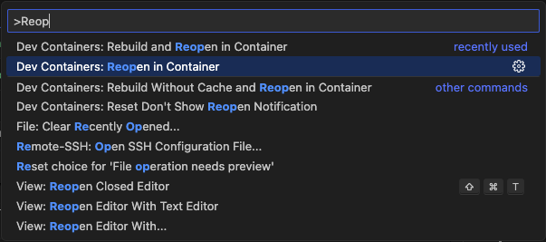
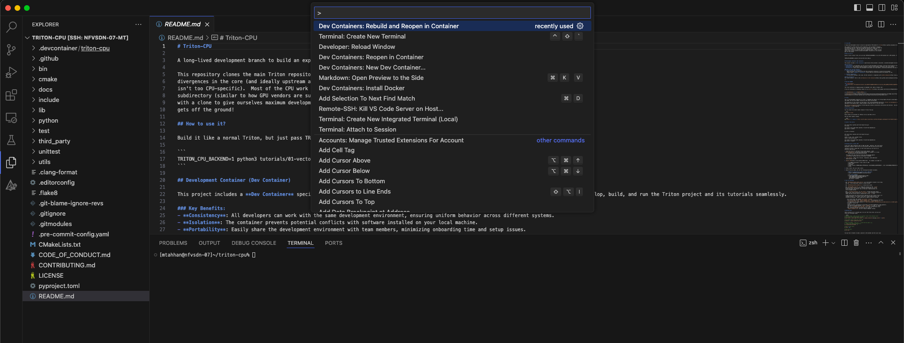

# Device Containers Getting Started Guide

This guide will walk you through using a [Development Container](https://containers.dev/)
configured with all the tools needed to build and run Triton. The Dev
Container setup is compatible with local development in Visual Studio Code
and with GitHub Codespaces for cloud-based workflows.

## Prerequisites

* **VSCode**
* **Docker**
* **NVIDIA Container Toolkit for GPU Usage**
* **VSCode Dev Containers Extension**

> **_NOTE_**: Details of the Dev Container prerequisites can be found
[here](https://code.visualstudio.com/docs/devcontainers/tutorial#_prerequisites).

> **_NOTE_**: If you are using an NVIDIA GPU, you also need to complete the steps
  to install the [NVIDIA Container Toolkit](https://docs.nvidia.com/datacenter/cloud-native/container-toolkit/latest/install-guide.html).

## Basic Workflow:

1. Dev Container Configuration: `.devcontainer/triton/devcontainer.json`
   file is set up with configuration details: the Docker image to use,
   extensions to install, environment variables...
   > **_NOTE_**: The Dev Container configuration provided supports both root
   (not recommended) and non-root (recommended) users.
2. Open project in Container: Open the project folder in VS Code or Github
   workspaces to build and attach the development environment.
3. Development: Work as usual, with access to tools and dependencies defined
   in the container.

The following sections will walk through Step 2 in detail.

### Running in Visual Studio Code

Follow these steps to launch and work with the Dev Container in Visual
Studio Code.

Open the project in Visual Studio Code. A pop up will appear asking to reopen
in project in a Dev Container.


If the pop up doesn't appear, the container can be launched by accessing the
Visual Studio Code Command Palette and looking for the: `Dev Containers: Reopen in Container`
option as shown below.



Visual Studio Code will relaunch inside the Dev Container.

When the container is ready the Triton tutorials can be run as follows:

```bash
pip install -e './python[tutorials]'
```

> **_NOTE_**: This step can take a few minutes to complete.

```bash
python python/tutorials/01-vector-add.py
```

### Running in Github Codespace

Use GitHub Codespaces for cloud-based development with the same Dev Container configuration.

> **_NOTE_**: GPU-powered Codespaces depends on [limited beta access](https://github.blog/changelog/2023-08-24-github-codespaces-gpu-limited-beta-update/).

### Running the Tutorials in the Dev Container

1. Navigate to your repository and click the `< >Code` dropdown.

2. In the Codespaces tab, click the ellipsis (...), then select `+ New with Options`

3. Edit the Branch, the Dev Container configuration (Triton), GPU and CPU settings.

4. Click the Button to `Create codespace`.
  > **_NOTE_**: This step can take a few minutes to complete.

When the codespace is available the Triton tutorials can be run as follows:

```bash
pip install -e './python[tutorials]'
```

```bash
python python/tutorials/01-vector-add.py
```

## Building Trion with a custom LLVM in Dev Container

To build Triton with a custom version of LLVM, please enable the following in
the [Dockerfile](../triton/Dockerfile)

```dockerfile
FROM registry.access.redhat.com/ubi9/ubi:latest as build
USER 0
RUN dnf update -y
RUN dnf -y install clang rpm-build git ninja-build cmake
RUN git clone https://github.com/llvm/llvm-project
WORKDIR /llvm-project
# UPDATE COMMIT SHA if required.
RUN git checkout 49af6502
RUN mkdir build
WORKDIR /llvm-project/build
RUN cmake -G Ninja -DCMAKE_BUILD_TYPE=Release -DLLVM_ENABLE_ASSERTIONS=ON ../llvm -DLLVM_ENABLE_PROJECTS="mlir;llvm" -DLLVM_TARGETS_TO_BUILD="host;NVPTX;AMDGPU"
RUN ninja
```

and

```dockerfile
## Uncomment to enable specific LLVM build
COPY --from=build /llvm-project/build /llvm-project/build
ENV LLVM_BUILD_DIR=/llvm-project/build \
    LLVM_INCLUDE_DIRS=$LLVM_BUILD_DIR/include \
    LLVM_LIBRARY_DIR=$LLVM_BUILD_DIR/lib \
    LLVM_SYSPATH=$LLVM_BUILD_DIR
```
