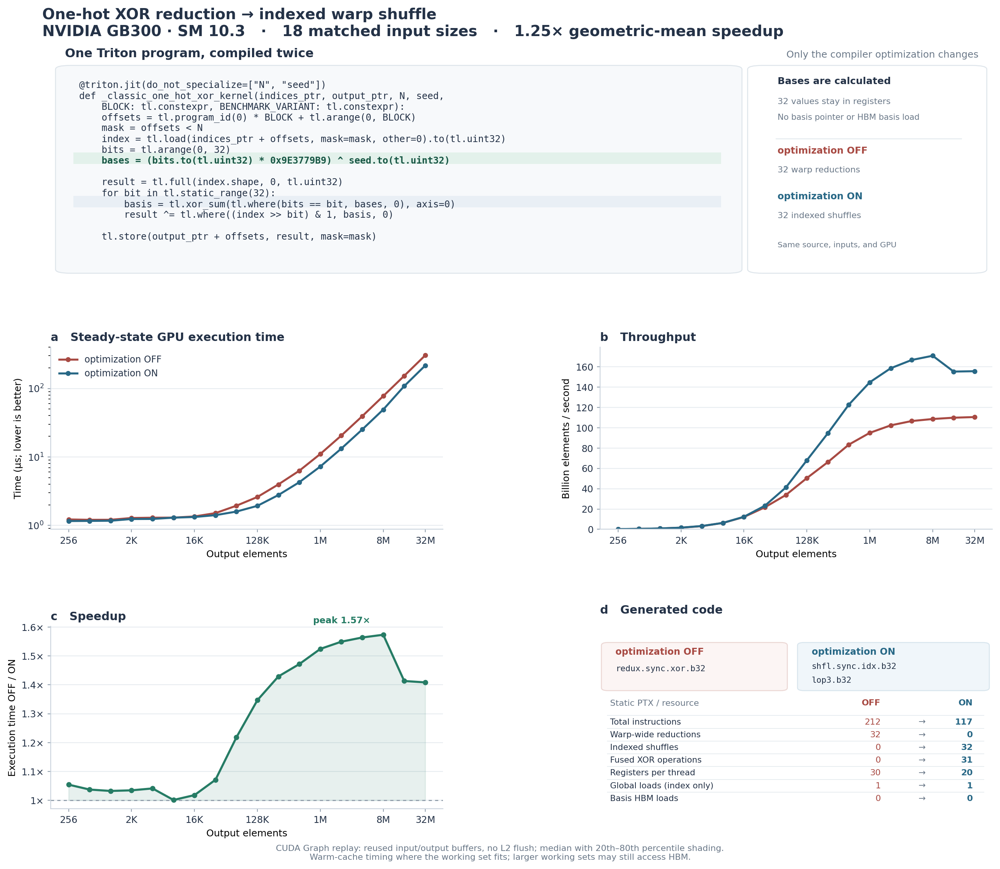

# One Triton program, one compiler optimization

## Result

On **NVIDIA GB300**, compiling the same ordinary Triton program with a late one-hot-XOR-reduction optimization disabled and enabled gives a **1.247× geometric-mean speedup** across 18 input sizes, with a **1.573× peak**. For inputs with at least 1,048,576 elements, the geometric mean is **1.504×**.

The 32 basis values are computed from a runtime scalar and `tl.arange`; they remain in registers. There is no basis pointer, basis buffer, or HBM basis read. Both generated kernels contain exactly one global input load and one global output store.



## Exact benchmarked Triton program

The following single kernel is compiled twice. Its source, inputs, runtime seed, GPU, and launch configuration are unchanged; only the compiler optimization is switched off or on. `BENCHMARK_VARIANT` isolates the compiler-cache entries and does not participate in the kernel computation.

```python
@triton.jit(do_not_specialize=["N", "seed"])
def _classic_one_hot_xor_kernel(
    indices_ptr,
    output_ptr,
    N,
    seed,
    BLOCK: tl.constexpr,
    BENCHMARK_VARIANT: tl.constexpr,
):
    offsets = tl.program_id(0) * BLOCK + tl.arange(0, BLOCK)
    mask = offsets < N
    index = tl.load(indices_ptr + offsets, mask=mask, other=0).to(tl.uint32)
    bits = tl.arange(0, 32)
    bases = (bits.to(tl.uint32) * 0x9E3779B9) ^ seed.to(tl.uint32)

    result = tl.full(index.shape, 0, tl.uint32)
    for bit in tl.static_range(32):
        basis = tl.xor_sum(tl.where(bits == bit, bases, 0), axis=0)
        result ^= tl.where((index >> bit) & 1, basis, 0)

    tl.store(output_ptr + offsets, result, mask=mask)
```

The optimization recognizes each one-hot `tl.xor_sum(tl.where(...))` after layout assignment. For a basis distributed one value per warp lane, it replaces the warp-wide XOR reduction with an existing singleton gather and unsplat; NVIDIA lowering emits an indexed warp shuffle. Subsequent conditional XORs are combined into `lop3.b32` when applicable, with an LLVM freeze preserving the original select's poison masking. No new Triton language or IR primitive is introduced.

## Experimental method

- **GPU:** NVIDIA GB300; SM 10.3; 152 multiprocessors.
- **Inputs:** 18 output sizes from 256 to 33,554,432 32-bit elements; block size 128.
- **Compared programs:** ordinary Triton only; one register-computed-basis kernel; optimization OFF versus optimization ON.
- **Compiler provenance:** the benchmark records that the Python frontend, NVIDIA backend, and native pass were loaded from `/tmp/triton-reduction-warp-shuffle-cheng`; both variants compile the same JIT source through that backend.
- **Artifact validation:** source digests are checked against the renderer's checkout; correctness flags, timing statistics, requested-size coverage, and summary metrics must agree. Recorded provenance is not authentication of a benchmark run or proof that a remote native binary was built from those sources. A remote binary's digest cannot be independently rehashed on the rendering machine.
- **Compiler-cache isolation:** fresh temporary compiler cache plus unused BENCHMARK_VARIANT constexpr; the pre-pass TTIR and TTGIR are checked for exact equality.
- **Global memory operations:** 1 → 1 index loads and 1 → 1 output stores; 0 basis HBM reads in either variant.
- **Execution time:** steady-state GPU kernel execution time in microseconds. CUDA events measure replay of a graph containing many copies of the kernel; elapsed replay time divided by the number of copies gives per-kernel execution time. Replay reduces CPU launch overhead and repeatedly reuses the same input/output buffers without flushing L2. This is a warm-cache measurement when the working set fits; larger working sets are not assumed to remain entirely in L2. The figure reports the median over ten replays, with the 20th–80th percentiles shaded.
- **Sampling:** `100 ms` requested repetition budget; `do_bench_cudagraph` chooses the graph length from a runtime estimate, so actual replay duration can differ. Measurement order alternates between successive requested input sizes.
- **Throughput:** output elements divided by median execution time, reported in billions of elements per second.
- **Correctness:** both variants are compared bit-for-bit with a PyTorch implementation of the same runtime-seeded basis arithmetic.

## Execution time and throughput

| Output elements | Optimization OFF, μs | Optimization ON, μs | Speedup | Throughput OFF → ON, billion elements/s |
| ---: | ---: | ---: | ---: | ---: |
| 256 | 1.222 | 1.158 | 1.055× | 0.21 → 0.22 |
| 65,536 | 1.940 | 1.592 | 1.218× | 33.78 → 41.16 |
| 1,048,576 | 11.047 | 7.247 | 1.524× | 94.92 → 144.69 |
| 8,388,608 | 77.279 | 49.121 | 1.573× | 108.55 → 170.77 |
| 33,554,432 | 303.745 | 215.669 | 1.408× | 110.47 → 155.58 |

At the peak, **N = 8,388,608**: **77.279 → 49.121 μs**, or **1.573×**.

## Generated code

| Static PTX / resource | Optimization OFF | Optimization ON |
| --- | ---: | ---: |
| Total PTX instructions | 212 | 117 |
| `redux.sync.xor.b32` | 32 | 0 |
| `shfl.sync.idx.b32` | 0 | 32 |
| `lop3.b32` | 0 | 31 |
| Registers per thread | 30 | 20 |
| Global index loads | 1 | 1 |
| Global output stores | 1 | 1 |
| Basis HBM loads | 0 | 0 |

These are static instruction counts from generated PTX, not dynamic hardware performance-counter measurements.

## Boundary correctness

Both optimization settings match the reference for **11/11** additional masked-tail input sizes; sentinel values beyond each logical output remain unchanged.

Checked sizes: 1, 31, 32, 33, 127, 128, 129, 255, 257, 1000, 4097.

## Reproduce

```bash
PYTHONPATH=python python python/test/microbenchmark/one_hot_xor_reduction.py \
  --output benchmarks/one_hot_xor_reduction/results.json \
  --sizes 256,512,1024,2048,4096,8192,16384,32768,65536,131072,262144,524288,1048576,2097152,4194304,8388608,16777216,33554432 \
  --block 128 --seed 826366246 \
  --repetitions-ms 100

python python/test/microbenchmark/plot_one_hot_xor_reduction.py \
  benchmarks/one_hot_xor_reduction/results.json \
  --output benchmarks/one_hot_xor_reduction/figure.pdf \
  --report-output benchmarks/one_hot_xor_reduction/REPORT.md
```

Kernel timing is a microbenchmark, not an end-to-end training-step measurement. Small inputs include per-kernel scheduling and graph-replay overhead; static PTX metrics do not measure dynamic memory traffic.
