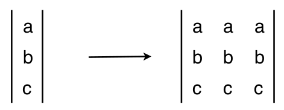
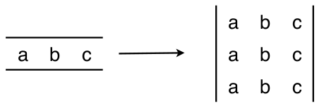

==========================================
The Triton-IR Intermediate Representation
==========================================

Triton-IR is an LLVM-based Intermediate Representation (IR) whose purpose is to provide an environment suitable for block-level program analysis, transformation and optimization.
In our implementation, Triton-IR programs are constructed directly from Triton-C after parsing, but they could also be formed directly by higher-level DSLs in the future.
Triton-IR and LLVM-IR programs share the same high-level structure, but the former also includes a number of extensions necessary for block-level data-flow analysis.
These extensions are crucial for carrying out the optimizations outlined in the next chapter of this document.

---------------------------------
Structure of a Triton-IR Program
---------------------------------

++++++++
Modules
++++++++

At the highest level, Triton-IR programs consist of one or multiple basic units of compilation known as *modules*. These modules are compiled independently from one another, and eventually aggregated by a linker whose role is to resolve forward declarations and adequately merge global definitions. Each module itself is composed of functions, global variables, constants and other miscellaneous symbols such as metadata and attributes.

++++++++++
Functions
++++++++++

Triton-IR function definitions consist of a return type, a name and a potentially empty arguments list. Additional visibility, alignment and linkage specifiers can be added if desired. Function attributes (such as inlining hints) and parameter attributes (such as "readonly", aliasing hints) can also be specified, allowing compiler backends to perform more aggressive optimizations by, for instance, making better use of non-coherent caches found on NVIDIA GPUs. This header is followed by a body composed of a list of basic blocks whose interdependencies form the Control Flow Graph (CFG) of the function.

+++++++++++++
Basic Blocks
+++++++++++++

Basic blocks are straight-line code sequences that may only contain so-called *terminator* instructions (i.e., branching, return) at their end. To simplify program analysis, Triton-IR uses the Static Single Assignment (SSA) form, meaning that each variable in each basic block must be (1) assigned to only once and (2) defined before being used. In so doing, each basic block implicitly defines a Data-Flow Graph (DFG). In our case, the SSA form is created directly from Triton-C's Abstract Syntax Trees (ASTs) using an algorithm from the literature [BRAUN13]_.

---------------------------------
Block-Level Dataflow Analysis
---------------------------------

+++++++
Types
+++++++

Multi-dimensional blocks are at the center of data-flow analysis in Triton-JIT. They can be declared using syntax similar to vector declarations in LLVM-IR. For example, :code:`i32<8, 8>` is the type corresponding to :math:`8 \times 8` blocks of 32-bit integers. Note that there is no preprocessor in Triton-IR, hence parametric shape  values must be resolved before programs are generated. In our case, this is done by Triton-JIT's auto-tuner.

+++++++++++++
Instructions
+++++++++++++

Triton-IR introduces a set of *reblocking* instructions whose purpose is to support broadcasting semantics as described in the previous chapter.  The :code:`reshape` instruction creates a block of the specified shape using the raw data from its input argument. This is particularly useful to re-interpret variables as higher-dimensional arrays by padding their input shapes with ones in preparation for broadcasting. The :code:`broadcast` instruction creates a block of the specified shapes by replicating its input argument as many times as necessary along dimensions of size 1 -- as shown below for the :code:`broadcast<3,3>` instruction.

|pic1| and |pic2|

Usual scalar instructions (:code:`cmp`, :code:`getelementptr`, :code:`add`, :code:`load`...) were preserved and extended to signify element-wise operations when applicable. Finally, Triton-IR also exposes specialized arithmetic instructions for reductions (:code:`reduce`) and matrix multiplications (:code:`dot`).

----------------------------------
Block-Level Control Flow Analysis
----------------------------------

In Triton-IR, operations on block variables are atomic: they execute either in full or not at all. As a result, traditional control flow structures (e.g., conditional, loops) are not applicable to individual block elements. This is problematic, since a program may need to e.g., partially guard blocked loads against memory access violations.

This could be potentially solved through the use of the Predicated SSA (PSSA) [CARTER99]_ [STOUTCHININ01]_ form for Triton-IR. However, this would create a lot of unnecessary complexity for GPUs, where the benefits of PSSA are close to none as divergent program paths  within warps are  serialized anyway. Therefore, recent versions of Triton handle intra-block control flow in a much simpler way, using conditional instructions such as  :code:`select`, :code:`masked_load` and :code:`masked_store`:

.. code-block:: llvm

  ; For all indices [idx], return cond[idx] ? true_value[idx] : false_value[idx];
  select       TYPE<TS1, ..., TSN> cond, true_value, false_value;
  ; For all indices [idx], return cond[idx] ? *true_addr[idx] : false_value[idx];
  masked_load  TYPE<TS1, ..., TSN> cond, true_addr, false_value;
  ; For all indices [idx], execute *true_addr[idx] = true_value[idx] if cond[idx]
  masked_store TYPE<TS1, ..., TSN> cond, true_addr, true_value;

------------
References
------------

.. [BRAUN13] M. Braun et al., "Simple and Efficient Construction of Static Single Assignment Form", CC 2013
.. [CARTER99] L. Carter et al., "Predicated Static Single Assignment", PACT 1999
.. [STOUTCHININ01] A. Stoutchinin et al., "Efficient Static Single Assignment Form for Predication", MICRO 2001
