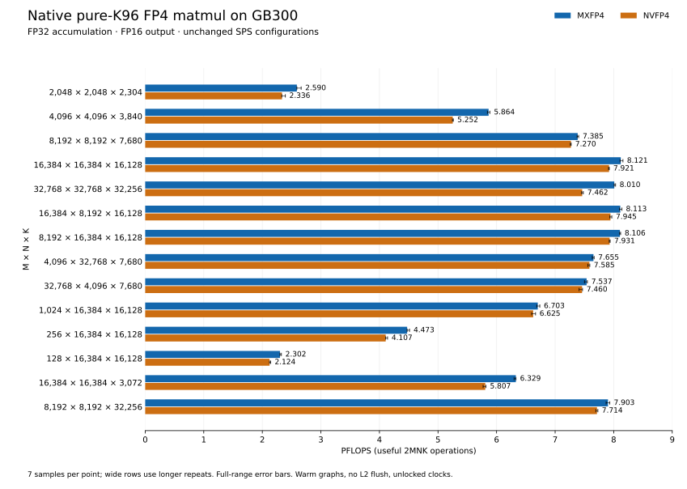

# Dense FP4 K96 performance

Measured on one NVIDIA GB300 (sm103) on 2026-08-24. This is the retained
native [example 07](07-pure-k96-matmul.py), without per-shape retuning.
Source checkpoint: `1f078e994a1026b12564a1dcef456262aa3f6beb`.

Large FP16-output cases approach 8 PFLOPS; the fixed M256 tile is less efficient
for small M and short reductions. FP16 and BF16 outputs are close in this sweep;
FP32 output reduces throughput with the default pipeline settings.

## Shapes

FP32 accumulation, FP16 output. Each cell is **latency in microseconds / PFLOPS**.
Throughput counts useful `2*M*N*K` operations, not padded M/N tile work.
The wide rows use their longer repeat; every original sample is retained below.

| Shape class | M | N | K | MXFP4 | NVFP4 |
| --- | ---: | ---: | ---: | ---: | ---: |
| square-2k | 2048 | 2048 | 2304 | 7.46 / 2.590 | 8.27 / 2.336 |
| square-4k | 4096 | 4096 | 3840 | 21.97 / 5.864 | 24.53 / 5.252 |
| square-8k | 8192 | 8192 | 7680 | 139.57 / 7.385 | 141.79 / 7.270 |
| square-16k | 16384 | 16384 | 16128 | 1066.21 / 8.121 | 1093.17 / 7.921 |
| square-32k | 32768 | 32768 | 32256 | 8647.57 / 8.010 | 9282.51 / 7.462 |
| tall | 16384 | 8192 | 16128 | 533.65 / 8.113 | 544.93 / 7.945 |
| wide | 8192 | 16384 | 16128 | 534.07 / 8.106 | 545.89 / 7.931 |
| very-wide | 4096 | 32768 | 7680 | 269.33 / 7.655 | 271.79 / 7.585 |
| very-tall | 32768 | 4096 | 7680 | 273.51 / 7.537 | 276.35 / 7.460 |
| small-m-1024 | 1024 | 16384 | 16128 | 80.73 / 6.703 | 81.69 / 6.625 |
| small-m-256 | 256 | 16384 | 16128 | 30.25 / 4.473 | 32.94 / 4.107 |
| small-m-128 | 128 | 16384 | 16128 | 29.39 / 2.302 | 31.85 / 2.124 |
| short-k | 16384 | 16384 | 3072 | 260.57 / 6.329 | 284.03 / 5.807 |
| long-k | 8192 | 8192 | 32256 | 547.81 / 7.903 | 561.20 / 7.714 |

### Longer rectangular repeat

At M=8192, N=16384, K=16128, increasing `rep_ms` from 150 to 500 gave:

| Input format | Initial PFLOPS | Longer-repeat PFLOPS |
| --- | ---: | ---: |
| MXFP4 | 8.151 | 8.106 |
| NVFP4 | 8.021 | 7.931 |

The NVFP4 value above 8 did **not** hold in the longer run. The main table
and chart use the longer measurements, not the higher initial values.
The original M=N=16384, K=16128 NVFP4 target remains 7.921 PFLOPS here.
Inputs and cubins match across repeats. This is run-to-run variation, not a code change;
small within-run sample variation does not establish a stable cross-run threshold.



## Output dtype

The inputs remain FP4 in every column; these are **output** dtypes.
Each cell is **microseconds / PFLOPS**. The same prepared inputs are
verified by SHA-256 across all three output types.

| Input format | M=N | K | FP16 | BF16 | FP32 |
| --- | ---: | ---: | ---: | ---: | ---: |
| MXFP4 | 8192 | 7680 | 139.57 / 7.385 | 139.18 / 7.406 | 157.70 / 6.537 |
| NVFP4 | 8192 | 7680 | 141.79 / 7.270 | 141.32 / 7.294 | 164.30 / 6.274 |
| MXFP4 | 16384 | 16128 | 1066.21 / 8.121 | 1065.76 / 8.124 | 1154.68 / 7.499 |
| NVFP4 | 16384 | 16128 | 1093.17 / 7.921 | 1091.29 / 7.934 | 1232.62 / 7.025 |

## Measurement and configurations

- Seven samples per row; each sample is the mean of ten CUDA-graph replay timings.
  At least 800 device executions per sample; no overlapping GPU tests.
- Maximum seven-sample coefficient of variation: 0.949%; no samples were dropped.
- Fixed inputs, warmed CUDA graphs, no L2 flush, unlocked power-managed clocks.
  Quantization, scale packing, reference calculation, allocation and host launch overhead are not timed.
- Exact K256 TMA stages feed eight K96 MMAs per K768. Every listed K is divisible by 768.
  Small M uses the same 2CTA M256 tile; its unused rows are excluded from useful FLOPs.
- SPS, M/N tiles 256, traversal width16 for K<=16384 and width8 above.
  MXFP4 uses six coupled data/scale slots and N32/N16 output staging for 16/32-bit output.
  NVFP4 uses six data/five scale slots and N16 staging for FP16/BF16; FP32 uses five coupled slots and N32 staging.
  Therefore the FP32 comparison includes the default pipeline change, not only store bandwidth.
- Every case passes its dequantized FP32 reference and ten graph correctness replays.
  BF16 is compared to the rounded reference for the exact power-of-two benchmark inputs.
  The standalone example checks broader scales against the unrounded FP32 reference with
  a half-ulp BF16 output allowance; its two rounding-boundary diagnostics agree with FP64 dots.
- Six original FP16 square cases also alternate with hash-verified frozen binaries from the preceding cleanup.
  Those controls are replayed through the normal launcher, without recompiling.
  All six pass the individual 2% latency gate; their executable sections and launch metadata match.
- All 36 cases pass PTX/SASS checks: eight K96 instructions, exact scale selectors,
  continuation addressing and completion placement, and no register spills.

## Reproduce

For a quick check using the example's broader random scale distribution:

```bash
python python/examples/gluon/07-pure-k96-matmul.py \
  --M 8192 --N 16384 --K 16128 --format mxfp4 nvfp4 \
  --out-dtype float16 bfloat16 float32
```

For the recorded seed123 distribution, repeated timing and complete binary artifacts:

```bash
python python/examples/gluon/bench-tcgen05-pure-k96.py \
  --example 07-pure-k96-matmul.py --m 8192 --n 16384 --k 16128 \
  --format nvfp4 --out-dtype float16 --modes native --scheduler sps \
  --repeats 7 --rep-ms 150 --output /tmp/k96-wide-nvfp4
```

Use `--rep-ms 500` at the 8K/16K square anchors and `750` at 32K; the
harness verifies at least 300 timed device executions per sample. Reproduce the
longer wide rows above with `--rep-ms 500`.
All per-row commands, samples, input hashes, source/compiler/cubin identities,
resource usage and frozen comparisons are in
[k96-shape-dtype-measurements.json](k96-shape-dtype-measurements.json).
The raw data also identifies the uploaded content-addressed archive containing
all measured binaries, launch manifests, PTX/IR/SASS and test logs.
Earlier frozen measurement files remain unchanged.
