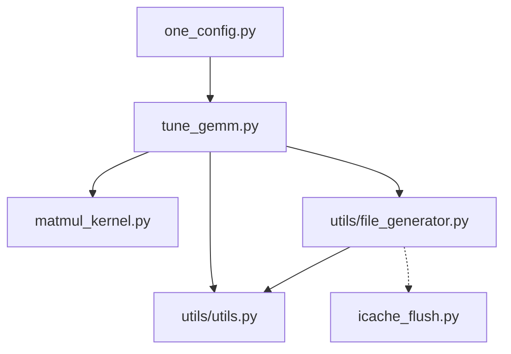

# GEMM tuning script (current v3.3)

## matmul kernel

The matmul kernel implementation can be found as [matmul_kernel.py](https://github.com/ROCm/triton/blob/main_perf/python/perf-kernels/tune_gemm/matmul_kernel.py), which includes the following features:
- grouping order of workgroup id, which is controlled by `GROUP_SIZE_M`, that
implements L2 cache optimization introduced in the [tutorial](https://triton-lang.org/main/getting-started/tutorials/03-matrix-multiplication.html#l2-cache-optimizations).
- split-k algorithm, which is controlled by `SPLIT_K`.
- Bias along M dim, which is controlled by `BIAS` and `bias_ptr`.
- Masked load along K dim inside the loop, which is controlled by `EVEN_K`.
This means `BLOCK_SIZE_K` does not need to divide K dim.

### Differences between the tutorial

Unlike the [matmul tutorial](https://github.com/triton-lang/triton/blob/main/python/tutorials/03-matrix-multiplication.py) (referred as the tutorial),
the matmul kernel used in the tuning script (referred as the kernel) does not
guard load along M and N dim
([this](https://github.com/triton-lang/triton/blob/main/python/tutorials/03-matrix-multiplication.py#L282-L283) shows how this is done in the tutorial).
When `BLOCK_SIZE_M` or `BLOCK_SIZE_N` does not divide M or N, the kernel will
load out-of-bound data.
In most cases this is fine, since the kernel does masked store at the end.
However, this may lead to GPU memory access fault in some cases, especially
when the tensor is large.
We will fix this issue in the future.


## Tuning script usage

### Tuning mode

The tuning script can take one or more gemm sizes and run tuning for them.
The input gemm sizes are prepared in a yaml file. Here is an example yaml file:
```yaml
- {'M': 4864, 'N': 4096, 'K': 8256, 'rowMajorA': 'T', 'rowMajorB': 'N'}
- {'M': 512, 'N': 512, 'K': 512, 'rowMajorA': 'T', 'rowMajorB': 'N'}
```

The tuning script works as follows
```python
./tune_gemm.py --gemm_size_file input.yaml [options]
```
The following `options` are supported in the tuning mode

- Input data types:
  - `-dtype_a dtype`, `-dtype_b dtype`, and `-dtype_c dtype`: input and output element type.
  - Supported `dtype`: fp16 (default), bf16, fp8, bf8, int8, int32, fp32
- Parallel compilation of kernels:
  - `--num_threads n` controls that n threads will
  be used in the compilation stage. The default value is 32.
  - `--no_warmup` can be used to skip the compilation stage. Thus kernels will be
  compiled during the profiling stage. This increases tuning time. But it's
  required for some old torch version, in which some function used in the warmup
  kernel launch is not supported.
- Parallel profiling of kernels: The tuning space is first divided into a number
of tasks, which is controlled by `--jobs n`. And all the tasks can be profiled in
parallel on a number of GPUs in the system. There are two ways to specify which
GPU(s) we want to use for profiling. Note that these flags cannot be use together.
By default, only one task is generated and profiled on GPU0.
  - `--ngpus n`: GPU 0,1,.., n-1 will be used.
  - `--gpu_ids ids`: `ids` are comma separated gpu ids and GPUs in `ids` will be used.
- General tuning control flags
  - `--init_type INIT_TYPE` defines how input data are initialized. `INIT_TYPE` can be
    - hpl: uniform distribution between -.5 and .5
    - trig_float: the distribution of elements in the flattened tensor follow
    the `sin` function.
    - zeros: initialize all data as 0, i.e. `torch.zeros`
    - randn (default): normal distribution, i.e. `torch.randn`
  - `--rotating_tensor SIZE`: provide the size of memory used for rotating tensor.
  The default is 0, meaning rotating tensor is not used.
  - `--icahe_flush`: If true, the script will generate a kernel to flush i-cache.
  The default is False.
  - `--bias_vector`: If true, a bias vector along the M dim is applied.
  The default is False.
- Correctness check
  - `--compare` will check the correctness of the best config for each gemm size.
  - `--compare_wo_tuning` will check the correctness of the config provided in
  the yaml file. If this is set, user needs to provide all the parameters in
  the input yaml file. Example can be found in the benchmark mode section.
- Logistics
  - `--keep` can be used to keep the files generated during the tuning process.
  Be default, intermediate files are removed at the end.
  - `--time_breakdown`: If set, the script will print out elapsed time during
  each stage of the tuning in real-time. The default is False.
  - `--verbose` will enable more logging message than `--time_breakdown`, such
  as output from rocprofv2
  - `--o OUTPUT` can be used to control the output filename to store the tuning
  result. The default filename is `tuning_results_branchName@gitCommit_timeStamp.yaml`.
  Therefore, each time the user runs the tuning script, a different output file
  will be generated.
- Hacks
  - `--hack_triton_compiler`: If set, the triton source code will be modified
  to provide a static backend target so that the compiler will not query
  GPU information. This makes sure that during the compilation stage, no
  hip runtime kernels are launched.
  Note that this is a very hacky option, because
    - It modifies the triton compiler directly, which is located from
    `pip show triton`.
    - It does string match and replace to modify the code.
    - It does not restore the code when the tuning session terminates.

Here are some example usages of running the script for tuning:

Tune some gemm sizes with f16 input
```python
./tune_gemm.py --gemm_size_file input.yaml --ngpus 8 --jobs 32 --o output.yaml
```
It's recommended to use as many GPUs as possible and set `--jobs` to
a value that is 4 to 6 times the number of GPUs.

If you are only allowed to use a subset of the GPUs, you can
```python
./tune_gemm.py --gemm_size_file input.yaml --gpu_ids 0,1,3,4 --jobs 32 --o output.yaml
```
This runs the profiling on GPU 0,1,3,4.

For bf8 input
```python
./tune_gemm.py --gemm_size_file input.yaml --ngpus 8 --jobs 32 -dtype_a bf8 -dtype_b bf8
```

Check correctness of the tuned configs
```python
./tune_gemm.py --gemm_size_file output.yaml --compare_wo_tuning
```


### Benchmark mode

In benchmark mode, the script will run a single given config multiple times to
collect performance data. The benchmark mode works as
The tuning script works as follows
```python
./tune_gemm.py --gemm_size_file input.yaml [options] --benchmark
```
The supported `options` are as followings
- `-dtype_a dtype`, `-dtype_b dtype`, and `-dtype_c dtype`: same as tuning mode.
- `--iters n` controls the number of iterations to run the kernel.
The default value is 1000.
- `--icache_flush`: same as tuning mode
- `--rotating_tensor SIZE`: same as tuning mode


## Tuning script implementation overview

The general idea of the tuning script can be summarized as
- Compile all the kernels in the tuning space in parallel.
- Divide the tuning space into tasks and invoke `rocprofv2` once per
task. This will save invocation overhead of the profiler.
- Profile tasks in parallel on multiple GPUs.

For detailed implementation, please refer to the changelog of each version.

### Dependency graph

The following graph depicts the dependency between Python modules:


`utils/file_generator.py` doesn't import `icache_flush.py` but it generates kernels that can import
`icache_flush.py`.


# Changelog

## GEMM tuning script v1

Shucai (@scxiao) implemented the first version of gemm tuning script: https://github.com/ROCmSoftwarePlatform/triton/pull/309

## GEMM tuning script v2

This version is based on v1 and @alefimov-amd's thread pool https://github.com/ROCmSoftwarePlatform/triton/pull/310

### Main features
- `rocprof` is used to measure the time for kernels in the full tuning space
- Each kernel is executed 10 times and the execution time of the last instance is used
- All kernels are compiled in parallel
- Two modes for correctness checking
    - During tuning, check correctness with the best perf_config for the current gemm size
    - Without tuning, check correctness based on the tuning results, which includes best perf_config for each gemm size
- The process takes about 30 - 40 minutes for the full tuning space with ~15000 configs
- Limitations
   - For now, only support fp16 as inputs. It should be trivial to extend to other types, but may require some work for mixed inputs

### Overview of implementations

Workflow of the tuning process
1. Generate the full tuning space. For now the `range`s for each tuning parameter are hard-coded
2. Prune the tuning space according to the current GEMM size and some rules
    - BLOCK_SIZE must be equal or larger than the mfma instruction size.
    - SPLIT_K * BLOCK_SIZE_K must divide K. Therefore, we do not need EVEN_K in the kernel.
    - When split-k is not needed, i.e. both M and N are large, it must be 1
    - GROUP_M * BLOCK_SIZE_M must be smaller than M. Otherwise, GROUP_M must be 1
    - When BLOCK_SIZE_K = 128, neither BLOCK_SIZE_M or BLOCK_SIZE_N can be 128. Otherwise too much LDS will be required. **Needs further investigation**
    - Skip BLOCK_SIZE_M or BLOCK_SIZE_N if they are over 2 times larger than M or N.
3. Open a file `generated_kernel{M}-{N}-{K}-{gpuid}.py` and write the following into the file
    1. For each config in the pruned space, generate a kernel with name `matmul_kernel_{configStr}`, where `configStr` contains the gemm size and the tuning parameters.
    2. Generate `matmul` function for each config in a similar way
    3. Generate `try_config` functions for each `matmul` function.
    4. Generate `test_gemm`, which does
        1. Add all `try_config` functions in the thread_pool by `thread_pool.apply_async(try_config)`. This is used to compile all kernels in parallel.
        2. Call each `matmul` function in a for loop of 10 iterations
    5. Generate `main` function
4. Run the generated script with 16 workers. This will compile all kernels in parallel.
5. Invoke `rocprof` on the generated script
6. Post process `results.csv` by extract the execution time of the last instance of each kernel. Pick the best one, write to file, and return.

## GEMM Tuning Script v3

### API changes

- Input and output data types can be provided as `-dtype_a`, `-dtype_b`, and `-dtype_c`.
The provided types must be one of ['fp32', 'fp16', 'bf16', 'fp8', 'bf8', 'int8'].
- Row/col major-ness of operand a and b can be provided as `-col_a` and `-col_b`.
If set, it means the corresponding operand is column major.
The major-ness is considered as problem input.
So they should be included in the input yaml file. However, in the yaml file, user should
set `rowMajowA` and `rowMajorB` as shown in the example below.
- `--benchmark` is used to control if the perf config in the input yaml file is used as the tuning space.
- `--jobs` is used to control the number of .py files for generated kernels.
Note that this can be different from `ngpus`. This usually means multiple kernel files
will be profiled on each GPU.
This is necessary to keep each file "small" in terms of execution time.

### Implementation changes
- `gen_input` is used to generate matmul inputs.
- Time measurement
    - In benchmark mode, the kernel is executed 1000 times.
    - In tuning mode, each kernel is executed 200 times. We cannot afford to larger runs since rocprof hangs if the session takes too long.
    - In both tuning and benchmark mode, kernel time is measured as the average execution time of the last 100 instances.
- Added error recovery. This helps when rocprof crashes in multi-processing mode.


## GEMM Tuning Script v3.1

### API changes

- Added `matrix_instr_nonkdim` into the tuning space. Now we can tune mfma instruction size.


## GEMM Tuning Script v3.2

### API changes

- Added `--rotating_tensor <value>` to use rotating memory blocks in each iteration, size in MB. Default is 0MB.
- Added `--icache_flush` to flush icache in each iteration.
Note, icache flush needs the module `python-hip`, which can be installed as:
`python3 -m pip install -i https://test.pypi.org/simple hip-python~=$rocm_version`
Rotating tensor and icache flush are to make perf numbers are closer to that in real applications.
- Added `--bias_vector` to support kernel execution with bias (bias vector is of the same size as the number of rows of the output matrix,
so each element of the bias vector is added to all elements of the corresponding row of the output matrix.)


## GEMM Tuning Script v3.3

### API changes

no API changes

### Implementation changes

- We use a dedicated file (named `get_filename_myKernels()`) to keep all the kernels
in the tuning space.
- Inside the for loop of tuning, each iteration tunes one gemm size
  1. Update kernel stage: Different gemm size may need different configs. We keep track
  of the current tuning space. And if the current gemm size needs some configs that is
  not included in the current tuning space, we expand the tuning space with the newly
  added configs.
    - This means if two gemm sizes share some configs, these configs will be compiled
    once. This will greatly reduce batch tuning time.
  2. Compilation stage:
    - We generate a single compilation driver file, named compile_driver.py (this is
    obtained from `get_filename_compile_driver`) which contains the wrapper functions
    of all the configs in the **pruned** tuning space for this gemm size.
    - All the kernels will be compiled by 32 threads by default. Compiling all the
    kernels in a single file in parallel is faster than splitting them into multiple
    files. This can greatly reduce the compile time of the tuning process.
    - Note that we no longer generate matmul_kernel in this file. Kernels are imported
    from myKernels.py.
  3. Profile stage
     - We generate one task file per job, named `profile_driver_MxNxK_{job_id}.py`
     (this is obtained from `get_filename_profile_driver`). The only difference is
     that we no longer generate matmul_kernel in this file. Kernels are imported
     from myKernels.py.
- `configStr` does not contain gemm size anymore. This allows the same matmul_{configStr}
kernel to be reused by different gemm sizes.
- `configStr` does not contain `_bias` if bias is provided. This is because we do not
expect to compare the same kernel w/ and w/o bias. Therefore, we treat bias in the same
way as gemm sizes.
- Add support for `EVEN_K` in the matmul kernel. Now the kernel support `BLOCK_SIZE_K`
that cannot divide `K`.
- Tuning result file is open and closed inside the tuning loop, enabling timely flush
of the tuning results.
- Now we use `rocprofv2` to measure kernel time.
- We can use `--hack_triton_compile` to avoid all GPU activities during the compilation
stage. This is achieved by modifying the triton frontend compiler in the following
places:
  - Return True from the `is_active()` function in the hip hackend [driver](https://github.com/triton-lang/triton/blob/fd691c67ac20958a67693358186d877790f5f48f/third_party/amd/backend/driver.py#L433)
  - Return statically constructed GPUTarget from the `get_current_target()`
  function in the hip backend [driver](https://github.com/triton-lang/triton/blob/fd691c67ac20958a67693358186d877790f5f48f/third_party/amd/backend/driver.py#L437)
  - Return False from the `is_active()` function in the cuda hackend [driver](https://github.com/triton-lang/triton/blob/fd691c67ac20958a67693358186d877790f5f48f/third_party/nvidia/backend/driver.py#L383)
  - Statically set `device` and `stream` in the [jit.py](https://github.com/triton-lang/triton/blob/fd691c67ac20958a67693358186d877790f5f48f/python/triton/runtime/jit.py#L588-L589)


# One config running script

`one_config.py` is a script that runs one given matmul config.
It is an interface to `tune_gemm.py` functionality and could be used for triton debugging.

## Usage

This script supports two methods to specify configuration parameters.

Variant 1: Separate command line attributes.

```bash
python one_config.py -m 256 -n 256 -k 256 --block_m 64 --block_n 64 --block_k 64 --group_m 1 --split_k 2 --num_warps 2 --num_stages 0 --waves_per_eu 0 --matrix_instr_nonkdim 16 --kpack 2
```

Variant 2: one-line config description.
This is how configs are printed by `tune_gemm.py` script

```bash
python one_config.py --config_str M16_N8_K128_BM64_BN64_BK64_GM1_SK2_nW2_nS0_EU0_kP2_mfma16
```
