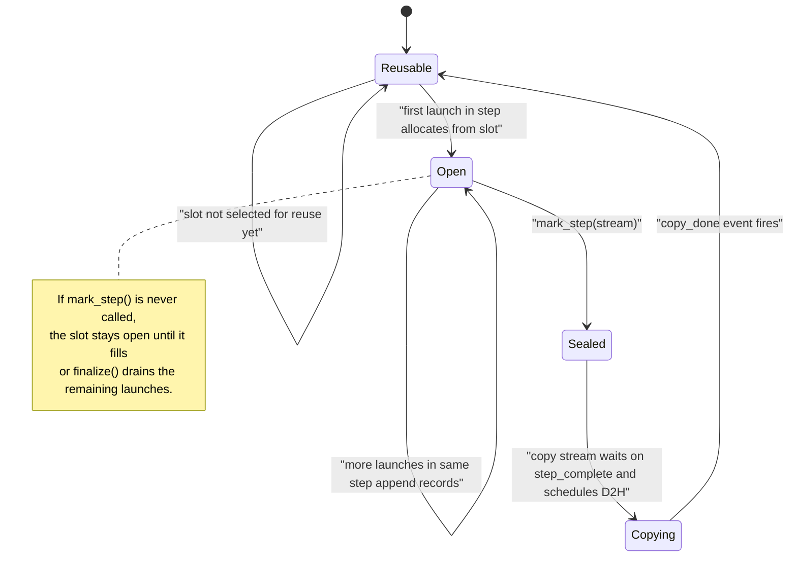
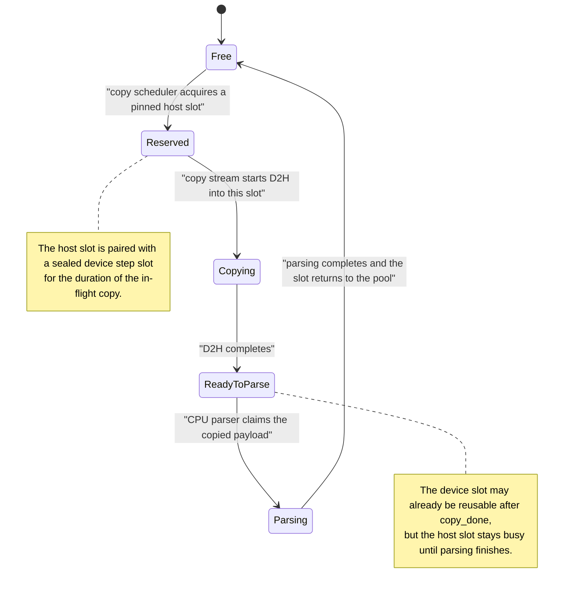

# Triton Kernel Profiling

## Goal

Design a Triton-based profiling path that records per-kernel launch timing with much lower perturbation than the current Proton instrumentation prototype.

The target output is a Chrome-trace-compatible timeline built from Triton kernel start and end times.

## Requirements

- No host sync per kernel launch.
- No host sync per step in the steady state.
- No blocking on the main compute stream after a step finishes, except when reusing a profiling buffer slot that is still in flight.
- Bounded GPU and host memory use.
- Stable enough buffer semantics to support CUDA graph capture later if needed.
- Support a future path where we add more per-kernel metadata than just start/end time.

## Non-Goals

- Exact per-CTA timing in the first version.
- CUPTI replacement for all kernels in the system.
- Solving bytes/flops accounting in the first version.
- A general-purpose trace storage system.

## Summary

Use Triton's hidden profiling scratch path to write one launch record per Triton kernel into a preallocated GPU step buffer.

At a user-defined step boundary:

- the user calls `mark_step(stream)`
- Proton records a step-complete event on the compute stream
- `mark_step()` immediately schedules async draining work
- a separate copy stream waits on that event
- the copy stream performs async device-to-host copies from the step buffer into pinned host staging buffers
- CPU parsing happens later, after the copy completes

The key design choice is that `mark_step()` should enqueue async draining work without synchronizing the host. The compute stream should only wait when it is about to reuse a GPU profiling slot that is still being copied.

## Core Model

### 1. GPU-side records

Each Triton kernel launch writes one profiling record:

- `start_time_ns`
- `end_time_ns`
- optional launch-local fields added later

The first version should use one per-kernel-launch record, not per-CTA records.

The device-side implementation can use one block leader per CTA with atomic min/max into the launch record:

- block leader at kernel entry: `atomicMin(start_time_ns, globaltimer())`
- block leader at kernel exit: `atomicMax(end_time_ns, globaltimer())`

This is not zero-overhead, but it is much cheaper than synchronizing the host after each launch.

### 2. Step buffers on GPU

Profiling storage on GPU should be preallocated and reused as an `N`-slot ring.

Each slot corresponds to one step worth of Triton kernel records.

For step `s`:

- compute stream writes profiling records into device slot `slot = s % N`
- `mark_step(stream)` seals that slot for the step
- copy stream drains that slot later
- compute stream may only reuse that slot after the copy for that slot is complete

This is an `N`-way ping-pong design. `N=2` is the smallest usable version, but a larger ring is safer because it reduces reuse stalls if copy or parsing falls behind.

### 3. Step fences

The user provides the step boundary explicitly with `mark_step(stream)`.

This records a `step_complete` event on the compute stream after all kernels for that step have been launched.

Important caveat:

- CUDA events are stream-local.
- If a step uses multiple compute streams, we need one event per participating stream, or a joined dependency on a final stream.

So the simplest API assumption is:

- one compute stream per step, or
- the caller is responsible for passing a stream whose ordering already represents the whole step.

### 4. Copy stream

Each device gets a dedicated copy stream.

For a sealed step:

- copy stream waits on the step's `step_complete` event
- copy stream launches async D2H copies from the device step slot into pinned host staging buffers
- copy stream records a `copy_done` event for that slot

This avoids putting the D2H copy itself on the compute stream.

## Why Use a Copy Stream

Doing the D2H copy on the compute stream is simpler because stream order already guarantees correctness.

The downside is that subsequent compute on that stream is serialized behind the copy.

Using a copy stream is more complex because it requires event wiring and buffer lifetime management, but it has the better performance shape:

- main compute stream records one event and continues
- D2H copy overlaps with later compute when hardware permits
- the compute stream only waits if it needs to reuse a profiling slot that is still in flight

So the preferred design is:

- copy stream for D2H
- no host sync in `mark_step()`
- compute stream waits only on slot reuse

## Avoiding CUDA Syncs

The steady-state path should avoid:

- `cudaStreamSynchronize` per kernel launch
- `cudaStreamSynchronize` per step
- `cudaDeviceSynchronize`

Instead:

- launch-time instrumentation writes to device memory only
- `mark_step(stream)` records `step_complete`
- `mark_step()` only enqueues work on the copy stream
- parsing happens after D2H completion without blocking the main stream

Only shutdown or explicit "drain everything now" paths should block.

That means:

- `mark_step()` becomes "seal the step and schedule async draining work"
- `finalize()` may still need to block to make sure all pending copies and parsing complete before writing the final artifact

## Host Buffer Management

We need a host-side staging pool in addition to the GPU step ring.

Reason:

- a GPU slot cannot be reused until its D2H copy finishes
- a host staging buffer cannot be reused until CPU parsing of that copied payload finishes

So the host should use a bounded pool of pinned staging buffers.

Recommended model:

- one pinned host slot per device ring slot as the minimum
- optionally more host slots than device slots if parsing can lag behind copying

Per step:

- copy stream copies device slot `i` into host staging slot `j`
- `copy_done` releases the device slot for reuse
- CPU parser later consumes host slot `j`
- parser marks host slot `j` free after parsing completes

This is effectively a host ring or host buffer pool.

### Overflow policy

Overflow should not silently drop trace data in the first version.

Preferred policy:

- bounded device ring
- bounded host staging pool
- backpressure on slot reuse when the system falls behind

This may stall profiling progress, but it preserves correctness.

If we later decide to support lossy modes, they should be explicit and observable.

## Step Lifecycle

For one step on one compute stream:

1. Kernels for the step launch and write timing records into device slot `i`.
2. User calls `mark_step(stream)`.
3. Proton records `step_complete[i]` on the compute stream.
4. `mark_step()` enqueues copy work:
   - copy stream waits on `step_complete[i]`
   - copy stream copies device slot `i` to pinned host slot `j`
   - copy stream records `copy_done[i]`
5. Compute stream may continue launching later steps immediately unless it needs to reuse slot `i`.
6. CPU parser consumes host slot `j`, builds kernel timing records, and eventually emits Chrome trace events.
7. Device slot `i` becomes reusable after `copy_done[i]`.
8. Host slot `j` becomes reusable after parsing completes.

State machine for one GPU step-buffer slot:

State machine for one host staging-buffer slot:

## Chrome Trace Construction

The first artifact target should stay simple:

- one Chrome trace event per Triton kernel launch
- event fields include:
  - kernel name
  - `ts`
  - `dur`
  - stream id
  - device id
  - call stack or launch context if available

This path should not depend on Hatchet tree aggregation.

Hatchet remains the right format for aggregated trees.
Chrome trace is the right format for exact per-launch timing and cross-rank imbalance at the kernel-invocation level.

For simplicity, the public API now couples step marking and async drain
scheduling. We can split those again later if we want a separate batching
control.

## Why Not Per-Launch Host Parsing

The current prototype proved correctness by:

- parsing per-launch profile scratch on the host
- synchronizing the stream before each parse

That is acceptable as a bring-up path, but it is the wrong performance shape.

The design in this document moves all hot-path work to:

- GPU writes at launch time
- async step-fenced D2H later

and pushes host parsing out of the critical path.

## Why Not Do the Reduction on GPU

For the later per-CTA fallback, the first reduction should stay on the host.

Reasons:

- the final consumer is already on the host
- min/max reduction over copied records is cheap
- host reduction preserves the option to keep full per-CTA detail for debugging
- adding a GPU reduction pass makes synchronization and buffer management more complicated

So the sequence should be:

- first version: one per-kernel-launch record on GPU
- fallback if contention is too high: per-CTA records on GPU, reduce on host

## Open Questions

- Whether one per-kernel record with atomic min/max is cheap enough for very short kernels.
- How large the device ring should be by default.
- Whether the host staging pool should be fixed-size or size-tiered.
- Whether `mark_step` should accept one stream only or support an explicit list of streams.
- Whether parsing should happen on a dedicated CPU thread or on demand during `finalize()`.
- How to expose overflow and backpressure stats to users.

## Recommended First Implementation

- Triton kernel timing only
- one launch record per Triton kernel
- explicit `mark_step(stream)` API
- one copy stream per device
- `N` preallocated GPU step slots
- `N` pinned host staging slots
- `mark_step()` that seals the step and schedules async D2H copies
- blocking `finalize()` that waits for remaining copies and parses all pending data
- Chrome trace output only for this path

This gets the main performance properties we want:

- no host sync per kernel
- no host sync per step
- no hard blocking of the main compute stream after each step
- bounded memory with explicit reuse rules

## Comparison with Current `proton_profiler`

The current OpenAI `proton_profiler` already solves file naming, phase management, and persistence, but its asynchronous behavior is at the host/file layer, not at the GPU-buffer layer.

### What file-output `proton_profiler` does today

There are two file-output paths today:

- non-periodic flushing in the OpenAI wrapper:
  - `flush()` calls `_force_read_phase_outputs(...)`
  - that fetches an already-materialized Proton phase payload with `proton.data.get_msgpack(...)` or `proton.data.get(...)`
  - only after the payload is host-visible does a background flush thread write it to `rank_<n>.<format>`
- periodic flushing in libproton:
  - Proton itself serializes completed phases with `toJsonString(...)` or `toMsgPack(...)`
  - Proton writes `.part_<phase>.<format>` files directly from C++

So the current "async" behavior is mainly:

- asynchronous disk write in the OpenAI wrapper, or
- periodic host-side serialization and file write in libproton

It is not:

- a preallocated GPU trace ring
- async D2H staged through a dedicated copy stream
- deferred host parsing of raw per-kernel timing records

### How current Proton gets GPU data to the host

This depends on the backend.

For the default CUDA backend, Proton uses CUPTI rather than a Triton-owned device timing buffer:

- CUPTI allocates host activity buffers with `aligned_alloc(...)`
- completed kernel activities are parsed from those host buffers
- `CuptiProfiler::doFlush()` does an opportunistic `cuda::ctxSynchronize(...)` before `cuptiActivityFlushAll(...)`

So the common CUDA file-output path already involves a CUDA sync during flush. It does not do a Triton-managed D2H copy of a per-kernel timing buffer.

For the Triton instrumentation backend, Proton does use a device-side `profile_scratch` buffer:

- each launch gets a `profile_scratch` allocation
- `InstrumentationProfiler::exitInstrumentedOp()` calls `runtime->synchronizeStream(streamId)`
- then the runtime path issues `memcpyDToHAsync(...)` and immediately follows it with `streamSynchronize(...)` before parsing

So the current instrumentation path also synchronizes. It is not yet an async copy-stream design.

### Why the proposed Triton timing path is different

The design in this document is solving a lower-level problem than today's file-output `proton_profiler` flow:

- keep per-kernel timing records in a preallocated GPU step ring
- let the user mark step completion explicitly
- copy those records later on a separate copy stream
- avoid host sync on every launch and avoid host sync as the normal step boundary
- build Chrome trace after the raw timing records are already safely staged on the host

Concrete differences:

- current file-output `proton_profiler`:
  - unit of persistence: completed Proton phase payload
  - write trigger: `flush()` / `finalize()` / periodic phase completion
  - GPU interaction: backend-specific flush logic, which currently synchronizes in both CUPTI and instrumentation paths
  - async portion: disk write thread only
- proposed Triton kernel-timing path:
  - unit of collection: per-step GPU slot containing many Triton kernel launch records
  - GPU interaction: explicit `mark_step(stream)` fence plus copy-stream D2H
  - async portion: D2H, host parsing, and file emission
  - target artifact: Chrome trace built from per-launch timing records

### How the approaches fit together

These approaches are complementary rather than contradictory.

`proton_profiler` is the right control-plane API and product surface for OpenAI callers:

- step/phase orchestration
- file output
- buffered host-side retention
- cross-rank collectors and downstream analysis

The Triton kernel-timing path should be treated as a new backend beneath that API:

- Triton runtime/compiler owns GPU timing records, device rings, step fences, copy streams, and host staging
- `proton_profiler` can later consume the resulting Chrome trace payloads or reduced timing summaries using the same high-level profiler lifecycle

So the right layering is:

- Triton/Proton runtime solves low-overhead device-side timing collection
- `proton_profiler` keeps solving orchestration, retention, and downstream consumption
