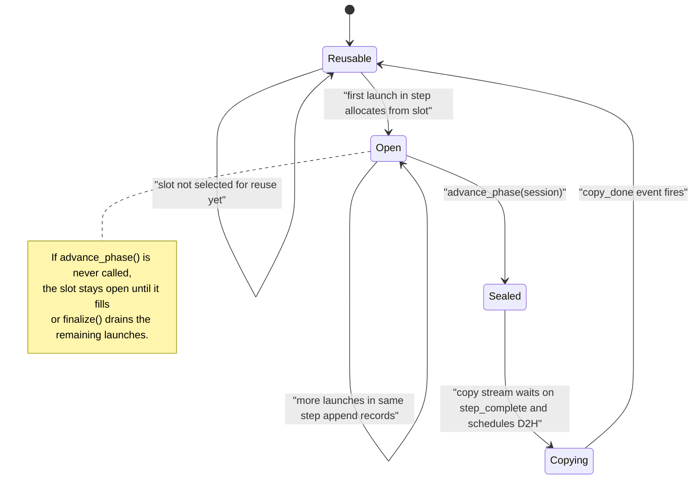
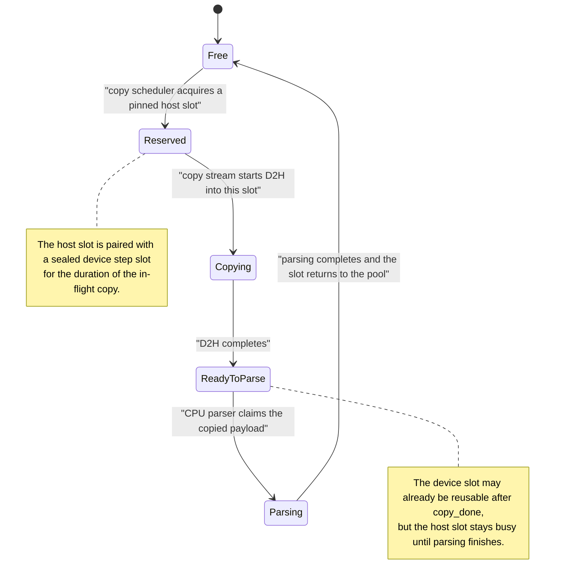

# Triton Kernel Profiling

## Goal

Design a Triton-based profiling path that records per-kernel launch timing with much lower perturbation than the current Proton instrumentation prototype.

The target output is a Chrome-trace-compatible timeline built from Triton kernel start and end times.

## Requirements

- No host sync per kernel launch.
- No host sync per step in the steady state.
- No blocking on the main compute stream after a step finishes, except when reusing a profiling buffer slot that is still in flight.
- Bounded GPU and host memory use.
- Stable enough buffer semantics to support CUDA graph capture later if needed.
- Support a future path where we add more per-kernel metadata than just start/end time.

## Non-Goals

- Exact per-CTA timing in the first version.
- CUPTI replacement for all kernels in the system.
- Solving bytes/flops accounting in the first version.
- A general-purpose trace storage system.

## Summary

Use Triton's hidden profiling scratch path to write one launch record per Triton kernel into a preallocated GPU step buffer.

At a user-defined phase boundary:

- the user calls `advance_phase(session)`
- Proton records a step-complete event on the current compute stream
- `advance_phase()` immediately schedules async draining work
- a separate copy stream waits on that event
- the copy stream performs async device-to-host copies from the step buffer into pinned host staging buffers
- CPU parsing happens later, after the copy completes

The key design choice is that `advance_phase()` should enqueue async draining work without synchronizing the host. The compute stream should only wait when it is about to reuse a GPU profiling slot that is still being copied.

## Core Model

### 1. GPU-side records

Each Triton kernel launch writes one profiling record:

- `start_time_ns`
- `end_time_ns`
- optional launch-local fields added later

The first version should use one per-kernel-launch record, not per-CTA records.

The device-side implementation can use one block leader per CTA with atomic min/max into the launch record:

- block leader at kernel entry: `atomicMin(start_time_ns, globaltimer())`
- block leader at kernel exit: `atomicMax(end_time_ns, globaltimer())`

This is not zero-overhead, but it is much cheaper than synchronizing the host after each launch.

### 2. Step buffers on GPU

Profiling storage on GPU should be preallocated and reused as an `N`-slot ring.

Each slot corresponds to one step worth of Triton kernel records.

For phase/step `s`:

- compute stream writes profiling records into device slot `slot = s % N`
- `advance_phase(session)` seals that slot for the step
- copy stream drains that slot later
- compute stream may only reuse that slot after the copy for that slot is complete

This is an `N`-way ping-pong design. `N=2` is the smallest usable version, but a larger ring is safer because it reduces reuse stalls if copy or parsing falls behind.

### 3. Step fences

The user provides the step boundary explicitly by advancing the profiling phase.

This records a `step_complete` event on the compute stream after all kernels for that step have been launched.

Important caveat:

- CUDA events are stream-local.
- If a step uses multiple compute streams, we need one event per participating stream, or a joined dependency on a final stream.

So the simplest API assumption is:

- one compute stream per step, or
- the caller is responsible for passing a stream whose ordering already represents the whole step.

### 4. Copy stream

Each device gets a dedicated copy stream.

For a sealed step:

- copy stream waits on the step's `step_complete` event
- copy stream launches async D2H copies from the device step slot into pinned host staging buffers
- copy stream records a `copy_done` event for that slot

This avoids putting the D2H copy itself on the compute stream.

## Why Use a Copy Stream

Doing the D2H copy on the compute stream is simpler because stream order already guarantees correctness.

The downside is that subsequent compute on that stream is serialized behind the copy.

Using a copy stream is more complex because it requires event wiring and buffer lifetime management, but it has the better performance shape:

- main compute stream records one event and continues
- D2H copy overlaps with later compute when hardware permits
- the compute stream only waits if it needs to reuse a profiling slot that is still in flight

So the preferred design is:

- copy stream for D2H
- no host sync in `advance_phase()`
- compute stream waits only on slot reuse

## Avoiding CUDA Syncs

The steady-state path should avoid:

- `cudaStreamSynchronize` per kernel launch
- `cudaStreamSynchronize` per step
- `cudaDeviceSynchronize`

Instead:

- launch-time instrumentation writes to device memory only
- `advance_phase(session)` records `step_complete`
- `advance_phase()` only enqueues work on the copy stream
- parsing happens after D2H completion without blocking the main stream

Only shutdown or explicit "drain everything now" paths should block.

That means:

- `advance_phase()` becomes "seal the step and schedule async draining work"
- `finalize()` may still need to block to make sure all pending copies and parsing complete before writing the final artifact

## Host Buffer Management

We need a host-side staging pool in addition to the GPU step ring.

Reason:

- a GPU slot cannot be reused until its D2H copy finishes
- a host staging buffer cannot be reused until CPU parsing of that copied payload finishes

So the host should use a bounded pool of pinned staging buffers.

Recommended model:

- one pinned host slot per device ring slot as the minimum
- optionally more host slots than device slots if parsing can lag behind copying

Per step:

- copy stream copies device slot `i` into host staging slot `j`
- `copy_done` releases the device slot for reuse
- CPU parser later consumes host slot `j`
- parser marks host slot `j` free after parsing completes

This is effectively a host ring or host buffer pool.

### Overflow policy

Overflow should not silently drop trace data in the first version.

Preferred policy:

- bounded device ring
- bounded host staging pool
- backpressure on slot reuse when the system falls behind

This may stall profiling progress, but it preserves correctness.

If we later decide to support lossy modes, they should be explicit and observable.

## Step Lifecycle

For one step on one compute stream:

1. Kernels for the step launch and write timing records into device slot `i`.
2. User calls `advance_phase(session)`.
3. Proton records `step_complete[i]` on the compute stream.
4. `advance_phase()` enqueues copy work:
   - copy stream waits on `step_complete[i]`
   - copy stream copies device slot `i` to pinned host slot `j`
   - copy stream records `copy_done[i]`
5. Compute stream may continue launching later steps immediately unless it needs to reuse slot `i`.
6. CPU parser consumes host slot `j`, builds kernel timing records, and eventually emits Chrome trace events.
7. Device slot `i` becomes reusable after `copy_done[i]`.
8. Host slot `j` becomes reusable after parsing completes.

State machine for one GPU step-buffer slot:

State machine for one host staging-buffer slot:

## Chrome Trace Construction

The first artifact target should stay simple:

- one Chrome trace event per Triton kernel launch
- event fields include:
  - kernel name
  - `ts`
  - `dur`
  - stream id
  - device id
  - call stack or launch context if available

This path should not depend on Hatchet tree aggregation.

Hatchet remains the right format for aggregated trees.
Chrome trace is the right format for exact per-launch timing and cross-rank imbalance at the kernel-invocation level.

For simplicity, the public API now couples step marking and async drain
scheduling. We can split those again later if we want a separate batching
control.

## Current Implementation Map

The current PR branch maps the design above to these main code paths:

- GPU profile buffer allocation:
  - `third_party/proton/proton/hooks/instrumentation.py`
  - `StepBufferRing._allocate_slot(...)` allocates each preallocated GPU step-buffer slot as a device `torch.uint8` tensor.
  - `StepBufferRing.allocate(...)` carves one launch allocation out of the current step slot.
  - `CudaAllocator.__call__(...)` is the Triton profile allocator entrypoint that routes kernel profile-scratch requests into the current step-buffer slot.
- Host staging buffer allocation:
  - `third_party/proton/csrc/lib/Profiler/Instrumentation/InstrumentationProfiler.cpp`
  - `InstrumentationProfiler::acquireHostStagingBuffer(...)` reuses or allocates pinned host staging buffers from the size-keyed pool.
  - `third_party/proton/csrc/lib/Runtime/CudaRuntime.cpp`
  - `CudaRuntime::allocateHostBuffer(...)` is the CUDA runtime implementation of the pinned host allocation.
  - `third_party/proton/csrc/lib/Runtime/HipRuntime.cpp`
  - `HipRuntime::allocateHostBuffer(...)` is the HIP counterpart.
- Collection of start/end timing on GPU:
  - `third_party/proton/Dialect/lib/ProtonGPUToLLVM/PatternProtonGPUOpToLLVM.cpp`
  - `InitializeOpConversion` lowers kernel-trace mode entry instrumentation to an atomic min into slot 0 of the launch record.
  - `FinalizeOpConversion` lowers kernel-trace mode exit instrumentation to an atomic max into slot 1 of the launch record.
  - `third_party/proton/proton/hooks/instrumentation.py`
  - `InstrumentationHook.initialize_kernel_trace_record(...)` initializes the launch record to `start=UINT64_MAX`, `end=0` before the kernel runs.
- D2H copy scheduling:
  - `third_party/proton/csrc/lib/Session/Session.cpp`
  - `SessionManager::markStep(...)` is the internal helper that seals the current step and schedules async draining for the public `advance_phase()` API.
  - `third_party/proton/csrc/lib/Profiler/Instrumentation/InstrumentationProfiler.cpp`
  - `InstrumentationProfiler::scheduleReadySteps(...)` waits on the step-complete event, acquires a host staging buffer, and enqueues the async D2H copy on the copy stream.
  - `third_party/proton/csrc/lib/Runtime/CudaRuntime.cpp`
  - `CudaRuntime::copyDeviceToHostAsync(...)` is the CUDA runtime implementation used by the copy stream.
  - `third_party/proton/csrc/lib/Runtime/HipRuntime.cpp`
  - `HipRuntime::copyDeviceToHostAsync(...)` is the HIP counterpart.
- Host parsing logic:
  - `third_party/proton/csrc/lib/Profiler/Instrumentation/InstrumentationProfiler.cpp`
  - `InstrumentationProfiler::processCompletedCopies(...)` detects completed async copies and hands each copied launch slice to the parser.
  - `InstrumentationProfiler::parseCopiedInstrumentedOp(...)` decodes the copied launch record and emits `KernelMetric` trace events for `trace_mode="kernel"`.

## Future Cleanup: Move GPU Step Buffers to C++

The current implementation splits ownership awkwardly:

- Python owns the per-device GPU step-buffer ring, per-launch suballocation,
  and slot reuse state.
- C++ owns step fencing, copy-stream scheduling, host staging, and parsing.

That split works, but it is not the cleanest long-term boundary. A better end
state is for C++ to own the entire step-buffer lifecycle.

### What would move out of Python

The following logic in
`third_party/proton/proton/hooks/instrumentation.py` would become C++-owned:

- `StepBufferRing`
- `StepBufferSlot`
- `ProfileScratchAllocation`
- step-slot allocation/reset/reuse
- per-launch offset assignment within a step slot
- slot wraparound and reuse fencing

Python would still decide when instrumentation is enabled and when the phase
advances, but it would stop tracking GPU slot state directly.

### Proposed API shape

The cleanest boundary is:

- Python asks libproton for one launch allocation for the current stream.
- C++ returns a lightweight allocation handle that exposes:
  - device pointer for Triton's hidden `profile_scratch`
  - allocation size
  - step-buffer token for later copy/reuse tracking
- Python passes that allocation through to Triton's existing profile allocator
  plumbing without knowing which slot it came from.

At the C++ interface level, that likely means replacing the current
"Python owns the ring, C++ owns only step fences" split with something closer
to:

- `allocateInstrumentedScratch(deviceId, streamId, size, alignment) -> allocation`
- `markStep(streamId)` or `markStep(streamId, stepToken)`
- `waitStepBuffer(streamId, stepToken)`

where `allocation` carries enough metadata for launch bookkeeping and later
D2H parsing.

### Resulting ownership model

With that refactor:

- Python hook responsibilities:
  - enable or disable instrumentation
  - patch Triton lowering and runtime hooks
  - request a launch allocation
  - advance the profiling phase
- C++ responsibilities:
  - allocate and recycle GPU step slots per device
  - assign launch offsets inside a slot
  - seal steps and record step-complete events
  - schedule copy-stream D2H work
  - manage host staging buffers
  - parse copied records
  - eventually move flush/reap work onto a background thread if needed

### Why this is a good follow-up refactor

Moving GPU step buffers into C++ is not required for correctness, but it has
clear benefits:

- one owner for slot state, step fences, D2H scheduling, and reuse
- less Python hot-path logic on every profiled launch
- fewer cross-language lifetime assumptions
- a cleaner path to moving `flush()` / reap work onto a background C++ thread

## Why Not Per-Launch Host Parsing

The current prototype proved correctness by:

- parsing per-launch profile scratch on the host
- synchronizing the stream before each parse

That is acceptable as a bring-up path, but it is the wrong performance shape.

The design in this document moves all hot-path work to:

- GPU writes at launch time
- async step-fenced D2H later

and pushes host parsing out of the critical path.

## Why Not Do the Reduction on GPU

For the later per-CTA fallback, the first reduction should stay on the host.

Reasons:

- the final consumer is already on the host
- min/max reduction over copied records is cheap
- host reduction preserves the option to keep full per-CTA detail for debugging
- adding a GPU reduction pass makes synchronization and buffer management more complicated

So the sequence should be:

- first version: one per-kernel-launch record on GPU
- fallback if contention is too high: per-CTA records on GPU, reduce on host

## Open Questions

- Whether one per-kernel record with atomic min/max is cheap enough for very short kernels.
- How large the device ring should be by default.
- Whether the host staging pool should be fixed-size or size-tiered.
- Whether phase advancement should support an explicit list of streams for multi-stream steps.
- Whether parsing should happen on a dedicated CPU thread or on demand during `finalize()`.
- How to expose overflow and backpressure stats to users.
- How robust the Triton-managed step-buffer model is under CUDA graph capture and replay:
  - current code now preallocates the current device's step-buffer ring at hook activation to avoid lazy device-buffer allocation during capture
  - but captured launches still bake in fixed profile-scratch pointers, so replay-time slot reuse and per-replay phase/drain semantics need dedicated validation
- Whether the inserted start/end timing IR is stable against NVIDIA backend instruction reordering, or whether we need stronger ordering constraints to keep the timestamps tightly bound to kernel entry/exit.

## Recommended First Implementation

- Triton kernel timing only
- one launch record per Triton kernel
- explicit `advance_phase(session)` API
- one copy stream per device
- `N` preallocated GPU step slots
- `N` pinned host staging slots
- `advance_phase()` that seals the step and schedules async D2H copies
- blocking `finalize()` that waits for remaining copies and parses all pending data
- Chrome trace output only for this path

This gets the main performance properties we want:

- no host sync per kernel
- no host sync per step
- no hard blocking of the main compute stream after each step
- bounded memory with explicit reuse rules

## Comparison with Current `proton_profiler`

The current OpenAI `proton_profiler` already provides the high-level control
plane:

- phase management
- file naming and persistence
- background file writing in the OpenAI wrapper when payloads are already
  host-visible

The interesting comparison for this design is really between the existing CUPTI
backend and the new Triton instrumentation backend.

### What CUPTI already provides

The CUPTI backend already has asynchronous delivery and deferred parsing:

- CUPTI allocates host activity buffers with `aligned_alloc(...)`
- GPU activity records are delivered into those host buffers asynchronously by
  CUPTI
- completed buffers are parsed in `completeBuffer(...)`
- that parsing happens on the CUPTI callback/profiler thread, not inline on the
  application's `advance_phase()` path

So "async copy" and "deferred host parsing" are not unique advantages of the
Triton path.

One important limitation of the current CUPTI explicit `flush()` path is that
it is still sync-heavy:

- `CuptiProfiler::doFlush()` does an opportunistic `cuda::ctxSynchronize(...)`
  before `cuptiActivityFlushAll(...)`

That synchronization is a completeness policy in the current explicit-flush
implementation:

- without it, CUPTI can still flush whatever activity records are already ready
- with it, `libproton` tries to make `flush()` reflect all GPU work completed so
  far on the current context
- the downside is that `flush()` can block on unrelated in-flight kernels and
  copies in that context

This does not apply the same way to `periodic_flushing` mode:

- periodic file emission is driven from `completeBuffer(...)` /
  `flushDataPhasesImpl(...)` on the backend thread when CUPTI activity buffers
  become ready
- that path does not go through `CuptiProfiler::doFlush()`
- so `periodic_flushing` does not incur the explicit `ctxSynchronize()` used by
  the manual `flush()` path

### What the Triton timing path changes

The Triton instrumentation backend changes the ownership model and the scope of
collection:

- collection is narrowed to Triton kernels only
- each Triton launch writes one compiler/runtime-owned timing record
- those records live in a Triton-managed GPU step ring
- `advance_phase(session)` provides an explicit step boundary for draining
- D2H is scheduled on a dedicated copy stream under Triton/Proton control

In steady state, its flush path is lighter than CUPTI's explicit `flush()` path:

- `InstrumentationProfiler::doFlush()` just schedules ready step copies and
  reaps already-completed ones
- it does not do a CUPTI-style context-wide synchronize in steady state

The Triton path still blocks at the final drain point:

- `InstrumentationProfiler::doStop()` synchronizes remaining streams and
  in-flight copy work so finalize output is complete

The main current downside is CPU parsing:

- completed D2H copies are still parsed inline on the caller thread during
  `advance_phase()`
- so parse cost can show up directly in the application's phase-advance path

### What it would take to remove context sync entirely

For `libproton` to support fully async profile collection with no
context-wide/device-wide synchronization in the steady-state path, the backend
contract would need to change from:

- "`flush()` should try to make profiling data complete up to now"

to:

- "`flush()` should only make forward progress on whatever profiling data is
  already ready"

For the CUPTI backend, that would likely require:

- changes in libproton's CUPTI backend implementation
- a non-blocking flush mode that skips `cuda::ctxSynchronize(...)`
- accepting that a given `flush()` may return only a partial prefix of the
  activity stream
- an explicit readiness/completeness contract for callers, so phase/file output
  knows whether it is writing "all work so far" or just "all records currently
  available"
- likely more background polling or callback-driven draining in libproton,
  rather than treating `flush()` as the point where completeness is enforced

This does not automatically mean changes to NVIDIA's CUPTI API itself. The
first problem is that libproton's current CUPTI backend chooses completeness by
synchronizing the context before flush.

For the Triton instrumentation backend, the main remaining work is different:

- keep the current copy-stream D2H scheduling
- move `processCompletedCopies(false)` off the caller thread and onto a
  background C++ parser/reaper thread
- keep `doStop()` as the explicit blocking final drain, unless we later add a
  stronger asynchronous completion API there too

So the blocker is not the same in the two backends:

- CUPTI: changing libproton's CUPTI backend so it can make forward progress
  without the current completeness-oriented context sync policy
- Triton instrumentation: removing caller-thread CPU parsing while preserving
  the current async copy-stream behavior

### Practical tradeoffs

Current advantages of the Triton path:

- Triton-only collection, which can be a feature if the goal is to focus on
  Triton kernel imbalance
- a simple per-launch start/end record model owned by the Triton compiler and
  runtime
- explicit step-fenced draining semantics under Triton/Proton control
- no CUPTI-style sync-heavy flush in the steady state path

Current caveats of the Triton path:

- narrower scope can also be a bug if the user wants a full CUDA timeline
- CPU parsing is currently inline on `advance_phase()`, whereas CUPTI parsing
  already runs on a backend-managed thread
- so today it is not strictly "better than CUPTI"; it is a different tradeoff
  with different control points

### Artifact and output layering

Above either backend, `proton_profiler` still handles:

- phase-oriented lifecycle
- wrapper-level file flushing
- cross-rank collection and downstream analysis

The Triton kernel-timing path should therefore be treated as a backend beneath
that API surface, not as a replacement for `proton_profiler` itself.

### How the approaches fit together

These approaches are complementary rather than contradictory.

`proton_profiler` is the right control-plane API and product surface for OpenAI callers:

- step/phase orchestration
- file output
- buffered host-side retention
- cross-rank collectors and downstream analysis

The Triton kernel-timing path should be treated as a new backend beneath that API:

- Triton runtime/compiler owns GPU timing records, device rings, step fences, copy streams, and host staging
- `proton_profiler` can later consume the resulting Chrome trace payloads or reduced timing summaries using the same high-level profiler lifecycle

So the right layering is:

- Triton/Proton runtime solves low-overhead device-side timing collection
- `proton_profiler` keeps solving orchestration, retention, and downstream consumption
